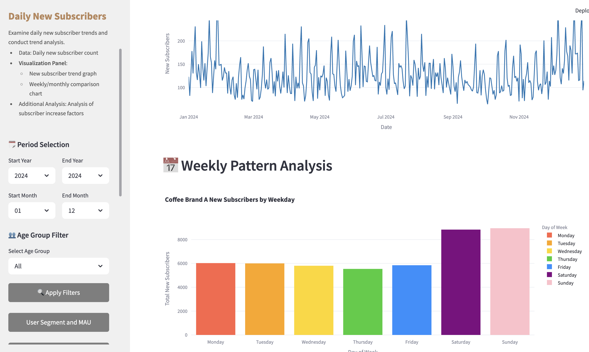
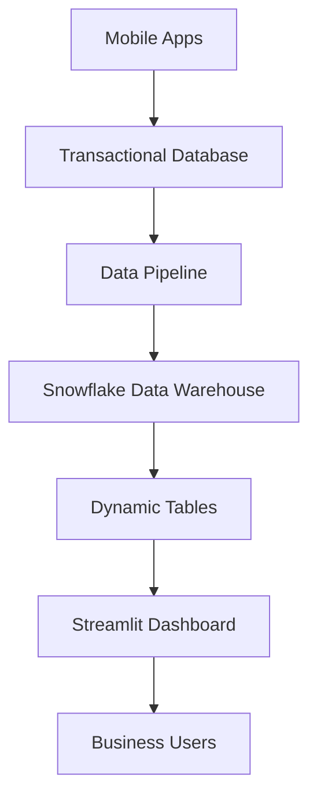

# 🚀 Multi-Brand Analytics Platform (Portfolio Project)



_Sample: Multi-Brand Analytics Dashboard Main Screen_

## 📋 Project Overview

The **Multi-Brand Analytics Platform** is an integrated data analytics dashboard for multi-brand coffee chains. It provides real-time customer analytics, operational monitoring, and marketing insights via a web-based dashboard, powered by a Snowflake data warehouse.

> ⚠️ **Portfolio Project**: Actual brand names and sensitive data are masked for privacy.

### 🎯 **Project Significance**

- **Data Democratization**: Intuitive analytics tools accessible to non-developers
- **Real-Time Insights**: Real-time analytics using Snowflake dynamic tables
- **Brand-Specific Analysis**: Tailored analytics for Brand A/Brand B
- **Operational Efficiency**: Zero-downtime service via Blue-Green deployment
- **Scalability**: Modular architecture for easy addition of new analytics pages

---

## 🏗️ **System Architecture**

### **Data Flow**



### **Tech Stack**

- **Frontend**: Streamlit (Python)
- **Backend**: Snowflake, Snowpark
- **Infrastructure**: Docker, Nginx
- **Data Pipeline**: Snowflake Dynamic Tables
- **Authentication**: Custom Session Management
- **Deployment**: Blue-Green Deployment

### **Brand Schemas**

- **Brand A**: `ANALYSIS_BRAND_A.*`
- **Brand B**: `ANALYSIS_BRAND_B.*`

---

## 📊 **Key Analytics Features**

### **🧪 Currently Available Analyses**

1. **User Segments & MAU** - Monthly active users and segment analysis
2. **Daily New Subscribers** - New customer acquisition trends
3. **Region/Age Data** - Customer demographic analysis
4. **Heavy User Analysis** - High-frequency customer behavior patterns
5. **Menu-Based Heavy User Segmentation** - Product-based customer segmentation
6. **Sales by Category** - Product category performance analysis
7. **Repurchase Rate** - Customer repeat visit patterns
8. **📌 New/Signature Non-Purchasers** - Analysis of customers who have not purchased certain product groups
9. **🗺️ Regional Purchase Cycle & Key Products** - Regional marketing insights

### **🎯 Core Data Sources**

- `DT_BRAND_A_USER_COUNTS` - User count aggregation
- `DT_BRAND_A_MAU_USERS` - Monthly active users
- `DT_BRAND_A_USER_SEGMENTS` - User segments
- `DT_BRAND_A_SALES_BY_CATEGORY` - Sales by category
- `DT_BRAND_A_REGION_SALES` - Regional sales
- `DT_BRAND_A_HOURLY_SALES` - Hourly sales
- `DT_BRAND_A_NEW_MEMBERS` - New subscribers
- `DT_BRAND_A_AGE_GROUP_ANALYSIS` - Age group analysis
- `DT_BRAND_A_REPURCHASE_METRICS` - Repurchase analysis

---

## 🌐 **Deployment & Operations**

### **Port-Based Environment Setup**

| Environment        | Port | Role          | Access URL            | Deployment |
| ------------------ | ---- | ------------- | --------------------- | ---------- |
| 🔧 **Development** | 8501 | Dev/Debug     | http://localhost:8501 | Foreground |
| 🧪 **Testing**     | 8502 | QA/Staging    | http://localhost:8502 | Background |
| 🔵 **Blue Prod**   | 8503 | Prod Server A | http://localhost:8503 | Background |
| 🟢 **Green Prod**  | 8504 | Prod Server B | http://localhost:8504 | Background |

### **Automated Deployment Tools**

#### **1. Main Deployment Script**

```bash
./scripts/deploy.sh
# or
tpc-deploy
```

- Full deployment management via interactive menu
- Automated Blue-Green zero-downtime deployment
- Health check and rollback features

#### **2. Quick Commands**

```bash
tpc-dev      # Run development server
tpc-test     # Run test server
tpc-blue     # Run Blue production server
tpc-green    # Run Green production server
tpc-status   # Check status of all ports
tpc-deploy   # Run deployment tool
```

### **Blue-Green Deployment Process**

1. **Preparation**: Check currently running ports
2. **Deployment**: Deploy new version to standby port
3. **Verification**: Health check and feature testing
4. **Switch**: Change nginx upstream
5. **Cleanup**: Stop previous version server

---

## ☁️ **Cloud Deployment**

### **Current Deployment Environments**

- **Local Development**: Multi-port operation on MacOS
- **Cloud Ready**: AWS/GCP/Azure deployment scripts available
- **Containerization**: Docker image support (optional)

### **Cloud Deployment Architecture**

```
[Load Balancer] → [Blue/Green Instances] → [Snowflake DW]
                            ↓
                    [Health Check Endpoint]
                            ↓
                    [Monitoring & Logging]
```

### **Cloud Operations Features**

- **Auto Scaling**: Automatic scaling based on traffic
- **Health Monitoring**: Uses `/_stcore/health` endpoint
- **Zero Downtime**: Blue-Green deployment for uninterrupted service
- **Security**: VPC internal deployment, IAM-based access control

### **Cloud Deployment Scripts**

```bash
./scripts/deploy_cloud.sh    # Deploy to cloud environment
./scripts/run_ab_test.sh     # Set up A/B test environment
```

---

## 🔐 **Security & Authentication**

### **Authentication System**

- **Multi-Brand Accounts**: Separate accounts for Brand A/Brand B
- **Role-Based Access**: user/admin role management
- **Session Management**: 24-hour auto-expiry, file-based session storage

### **Account Structure**

```
brand_a_user  → Access to Brand A data
brand_b_user  → Access to Brand B data
admin         → Access to all brand data
```

### **Security Logging**

- Login attempt tracking
- Data access history logging
- IP-based monitoring
- Role change audit logs

---

## 📈 **Monitoring & Operations**

### **Real-Time Monitoring**

```bash
tpc-status               # Check server status by port
tpc-logs <port>          # Real-time log monitoring
curl localhost:8501/_stcore/health  # Health check
```

### **Operational Metrics**

- **Response Time**: Based on Streamlit health check
- **Memory Usage**: Resource monitoring by port
- **Concurrent Users**: Session-based user tracking
- **Data Cache**: 30-minute TTL cache efficiency

### **Log Management**

- **Port Logs**: `logs/streamlit_<port>.log`
- **Security Logs**: `security_events_port_<port>.log`
- **Auto-Rotation**: Automatic backup when exceeding set size
- **Centralized Logging**: ELK stack integration in cloud

---

## 🚀 **Quick Start**

### **1. Environment Setup**

```bash
# Install dependencies
pip install -r requirements.txt

# Snowflake connection setup
cp .streamlit/secrets.toml.example .streamlit/secrets.toml
# Enter Snowflake connection info in secrets.toml
```

### **2. Run Development Environment**

```bash
# Set up aliases (first time only)
./scripts/setup_aliases.sh
source ~/.zshrc

# Run development server
tpc-dev
```

### **3. Deployment**

```bash
# Test deployment
tpc-test

# Production deployment
tpc-deploy
```

---

## 🛠️ **Development Guide**

### **Add a New Analytics Page**

1. Create a new module in the `page_modules/` folder
2. Import and register the module in `app.py`
3. Implement Snowflake query and visualization logic
4. Apply `@st.cache_data(ttl=1800)` caching

### **Code Structure**

```
Multi-Brand-Analytics-Platform/
├── 📄 app.py                    # Main application
├── 📄 app_b.py                  # B version (A/B testing)
├── 📄 brand_config.py           # Brand settings
├── 📄 snowflake_connection.py   # DB connection management
├── 📄 security_config.py        # Security settings
├── 📄 requirements.txt          # Dependency management
├── 📁 page_modules/             # Analytics modules
│   ├── user_segment_mau.py
│   ├── new_subscribers.py
│   ├── sales_by_category.py
│   └── ...
├── 📁 config/                   # Config files
├── 📁 docs/                     # Documentation
├── 📁 scripts/                  # Deployment/management scripts
└── 📁 ssl_certs/               # SSL certificates
```

### **Brand-Specific Development**

- Dynamic schema switching: Use the `BRAND_SCHEMA` dictionary
- Brand-specific text: Use the `brand_texts` mapping
- Role-based access: Use the `role` parameter

---

## 📊 **Performance Optimization**

### **Caching Strategy**

- **Data Cache**: `@st.cache_data(ttl=1800)` 30-minute cache
- **Session Cache**: File-based session storage to prevent re-login
- **Query Optimization**: Use Snowflake dynamic tables

### **Scalability Considerations**

- **Horizontal Scaling**: Load distribution via independent port execution
- **Vertical Scaling**: Monitor and optimize memory usage
- **Database**: Utilize Snowflake's auto-scaling features

---

## 📚 **Documentation & Guides**

### **Operations Docs**

- [📜 Scripts Guide](docs/SCRIPTS_GUIDE.md) - Detailed script descriptions
- [🚀 Deployment Guide](docs/DEPLOYMENT_GUIDE.md) - Blue-Green deployment instructions
- [⚡ Quick Start](docs/QUICK_START.md) - Get started in 1 minute

### **Development Docs**

- [🔧 Development Setup](docs/DEVELOPMENT.md) - Setting up the dev environment
- [📊 Data Schema](docs/DATA_SCHEMA.md) - Snowflake table structure
- [🔐 Security Guide](docs/SECURITY.md) - Security settings and management

---

## 🎯 **Roadmap**

### **In Progress**

- ✅ Regional purchase cycle & key product analysis complete
- ✅ Blue-Green deployment automation complete
- ✅ Security logging system complete

### **Planned**

- 🔄 Real-time notification system
- 📱 Mobile responsive UI improvements
- 🤖 AI-powered automated insights
- 📊 Advanced visualizations (maps, heatmaps, etc.)
- 🔍 Customer journey analysis

### **Future Vision**

- **Multi-Cloud**: Simultaneous deployment to AWS, GCP, Azure
- **Real-Time Streaming**: Real-time data processing with Kafka
- **ML Integration**: Predictive analytics using Snowpark ML
- **API-ization**: Provide REST API for external system integration

---

## 👥 **Contributing**

### **Development Workflow**

1. Develop features in the dev environment (`tpc-dev`)
2. Test in the test environment (`tpc-test`)
3. Code review and approval
4. Deploy to production (`tpc-deploy`)

### **Coding Conventions**

- Follow Python PEP 8 style guide
- Use Korean for UI text
- Standardize visualizations with Plotly
- Apply 30-minute TTL cache

---

## 📞 **Support & Contact**

### **Troubleshooting**

1. **Check logs**: `tpc-logs <port>`
2. **Check status**: `tpc-status`
3. **Health check**: `curl localhost:8501/_stcore/health`
4. **Refer to docs**: Guides in the `docs/` folder

### **Contacts**

- **Development Team**: TESLA Dev Team
- **Operations Team**: TESLA Infra Team
- **Business**: Ten Percent Coffee/Mammoth Coffee Data Team

---

## 📄 **License**

This project was created for portfolio purposes.

---

**🚀 Multi-Brand Analytics Platform** - _Empowering Data-Driven Decisions_
